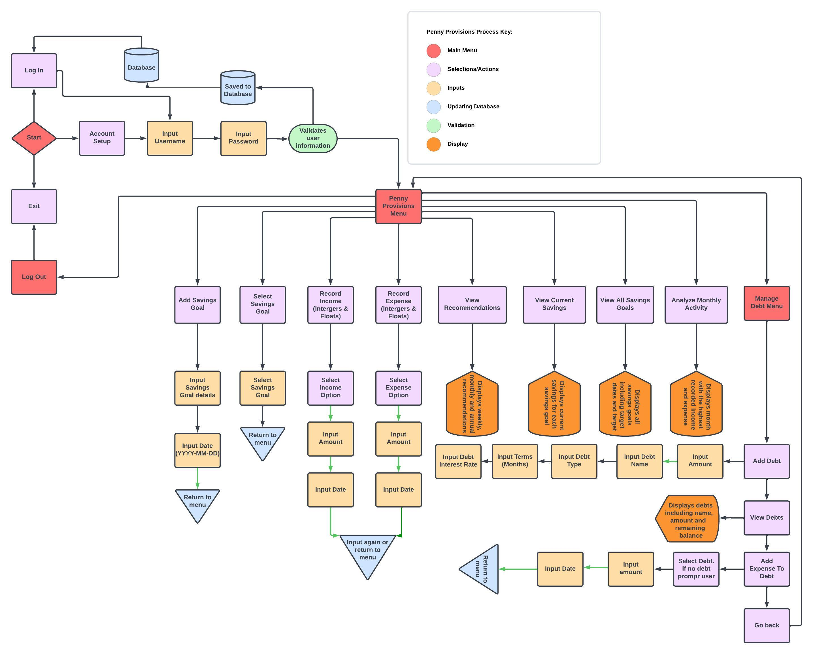

# Penny Provisions
---
## Live link to program

[Penny Provisions](https://penny-provisions-777f1206dc49.herokuapp.com/)

## Table of Contents
<ol>
<li>User Experience
    <ul>
        <li>Process Flow Chart</li>
        <li>Strategy Plane</li>
        <li>Scope Plane</li>
        <li>Structure & Skeleton Plane</li>
        <li>Surface Plane</li>
    </ul>
    </li>
<li>Testing</li>
<li>Bugs</li>
<li>Fixed Bugs</li>
<li>Deployment</li>
<li>Credits</li>
</ol>

## User Experience

### Process Flow Chart

### 5trategy Plane

### User Goals:
- **Financial Management:** Users aim to efficiently manage their finances, including savings goals and debts.
- **Budgeting:** Users seek a tool that helps them budget effectively by tracking income, expenses, and providing recommendations.
- **Savings Goals:** Users want a platform where they can set and monitor progress towards multiple savings goals.
- **Debt Management:** Users desire features to manage their debts conveniently within the same platform.
- **User-Friendly Experience:** Users expect clear prompts and instructions for easy navigation and use.

### Business Goals:
- **User Engagement:** Engage users by providing a comprehensive budgeting tool that meets their financial needs.
- **Customer Retention:** By offering valuable features like tracking, recommendations, and debt management, retain users on the platform.
- **Data Security:** Ensure the security and privacy of user data, fostering trust and confidence in the platform.

### Scope Plane

### Features:
1. **Savings Goals Management:**
   - Users can securely add multiple savings goals.
   - Track progress towards each goal, including current balance and target amounT.
   
2. **Income and Expense Tracking:**
   - Record and track income sources and amounts.
   - Record and categorize expenses to monitor spending habits.
   
3. **Recommendations:**
   - Weekly, monthly, and annual recommendations provided based on income, expenses, and savings goals.
   
4. **Debt Management:**
   - Users can manage debts, including adding, viewing, and updating debts.
   
5. **Analysis Tools:**
   - Ability to analyze monthly income and expenses to identify trends and patterns.
   - Confirm the month with the most income and expenditures to monitor spending habits.
   
6. **User-Friendly Prompts:**
   - Clear and concise prompts provided throughout the platform for easy navigation and understanding.
   - Illustrative instructions ensure a user-friendly experience.

### Structure & Skeleton Plane

#### Main Menu (3 options available to the user):
1. **Login:**
   - Option to log in to a pre-existing Penny Provisions account (If the users account is not created then a prompt will display).
   - Username and password required.
   - Password input hidden for additional security.

2. **Set Up Account:**
   - Allows the user to create a new Penny Provisions account.
   - User selects desired currency during account setup.
   - Upon account creation the user will be prompted to log in.
   - Option to exit the setup process.

3. **Exit:**
   - Option to exit the Penny Provisions application.

#### Penny Provisions Menu (10 options available to the user):
1. **Add Savings Goal:**
   - Allows the user to add a new savings goal.
   - Input required for goal name, target amount, and target date.

2. **Select Savings Goal:**
   - Option to select and view details of an existing savings goal(s).

3. **Record Income:**
   - Allows the user to record incomes and categorize them.

4. **Record Expense:**
   - Allows the user to record expenses and categorize them.

5. **View Recommendations:**
   - Provides weekly, monthly, and annual recommendations based on income, expenses, and savings goals.

6. **View Current Savings:**
   - Displays the current balance and progress of all savings goals.

7. **Manage Debts:**
   - Navigates the user to the Manage Debt Menu for debt-related actions.

8. **View All Savings Goals:**
   - Lists all existing savings goals for the user to view.

9. **Analyze Monthly Activity:**
   - Provides insights into the month with the highest recorded income and expenses.

10. **Log Out:**
    - Logs the user out of the Penny Provisions account.

#### Manage Debt Menu (4 options available to the user):
1. **Add Debt:**
   - Allows the user to add a new debt entry.
   - Input required for debt name, amount, type and interest rate.

2. **View Debts:**
   - Lists all existing debts for the user to view.

3. **Add Expense to Debt:**
   - Enables the user to add an expense directly to a specific debt entry.

4. **Go Back:**
   - Takes the user back to the Penny Provisions Menu.

### Surface Plane
- Employs clear and readable prompts for easy comprehension of text and prompts.
- Provides immediate feedback for user actions to enhance interactivity.

## Testing

Below is a table showing various actions performed on the website including the expected/desired outcome with the result on the final column.

| Action                                   | Expected Result                                                    | Result |
|------------------------------------------|--------------------------------------------------------------------|--------|
| Run Program                              | Program launches successfully.                                     |  Pass  |
| Set up account                           | User can successfully create an account.                           |  Pass  |
| Log in                                   | User can log in with valid credentials.                            |  Pass  |
| Log in with non-existent credentials     | Prompt no credentials found, options provided to reattempt or exit |  Pass  |
| Exit                                     | Program exits without errors.                                      |  Pass  |
| Add Savings Goal                         | User can add a savings goal.                                       |  Pass  |
| Select Savings Goal                      | User can select a savings goal to view or edit.                    |  Pass  |
| Record Income                            | User can record income for a savings goal.                         |  Pass  |
| Record Expense                           | User can record expenses for a savings goal.                       |  Pass  |
| View Recommendations                     | User can view recommendations to achieve savings target.           |  Pass  |
| View Current Savings                     | User can view current savings for each goal.                       |  Pass  |
| Manage Debts                             | User can manage debts (add, view, update, delete).                 |  Pass  |
| View All Savings Goals                   | User can view a list of all savings goals.                         |  Pass  |
| Analyze Monthly Activity                 | User can analyze monthly income and expenses.                      |  Pass  |
| Log Out                                  | User can log out securely.                                         |  Pass  |
| Add Debt                                 | User can add a debt.                                               |  Pass  |
| View Debts                               | User can view a list of all debts.                                 |  Pass  |
| Add Expense to Debt                      | User can record expenses against a specific debt.                  |  Pass  |
| Go Back                                  | User can navigate back to previous screens.                        |  Pass  |
| Input Future Dated Income/Expense        | Message is displayed to user to prevent future dated inputs        |  Pass  |
| Display prompts                          | Prompts are displayed to ensure user friendly navigation           |  Pass  |

## Bugs
* Upon selecting the "Add Expense" and selected Debt in the expense options I was prompted to select one of the debts from my manage debts menu. To resolve this I added a separate function to allow users to add a non priority debt to a savings goal and for priority debts then can use the manage debts menu which contains additional options such as term (in months) and an interest rate.

## Unfixed Bugs
* No unfixed bugs.

### Languages

**PYTHON**

## Deployment
The site was deployed to Heroku pages. The steps to deploy are as follows:
* Created a new app via Heroku and click creat new app.
* Added App name and selected region and clicked create app.
* On the app dashboard I then clicked "Settings".
* No API's were added so config vars were not added.
* Added Buildpacks by click "Add build pack".
* Added the python buildpack first followed by the nodejs buildpack ensuring they were in the correct order.
* Once project settings were configured I then navigated to the "Deploy" section.
* Selected GitHub as the deployment method.
* Searched for Penny-Provisions and clicked connect.
* Enabled automatic deploys and then clicked "Deploy Branch".
* Upon completion of the build and display message of "Your app was successfully deployed" I then clicked View.

The link can be found here - [Penny Provisions](https://penny-provisions-777f1206dc49.herokuapp.com/)

## Credits

**Content**
* The code relating to user login and user account creation was derived from Youtube videos from Digital Fox, Stack Overflow and Chat.openai.com for suggestions.